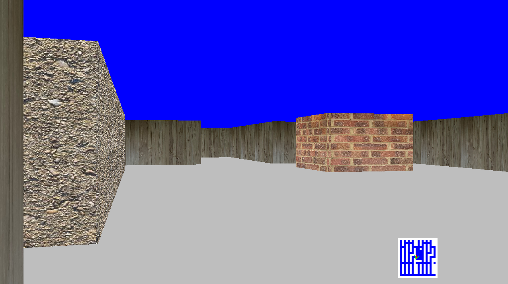

# QDRay
A quick and dirty raycaster using PyGame. It's pretty basic, and released for educational purposes, but could be used as the starting point for a game.

## Running

There is a requirements.txt file but it only has two entries - if you have installed pygame and numpy you are good to go.

## Modifying

Additional textures can be added to the assets folder, in the format <name>_<index>.png, and the code will automatically read them. The corresponding number can then be inserted into the map grid in assets/map.csv to paint a block with that texture.

## TODO

- The collision detection is iffy, you can get stuck in walls sometimes. 
- When very close to walls there is slow down; the method of scaling the texture columns is not optimised at all
- There isn't anything to do! Add some baddies etc. 
